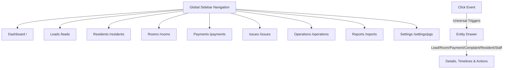

# Implementation Plan — PGOS V2.1 Strategic Restructure

Restructure the existing PGOS application to prioritize resident-centric navigation, vacancy filling, automated rent collections, and transparent tenant-owner relationships.

---

## User Review Required

> [!IMPORTANT]
> - **Lead Model Schema Migration (`schema.prisma`):**
>   We will introduce a new `Lead` model to track prospective tenants, interested rooms, sources, expected move-in dates, and pipeline statuses (New Lead, Contacted, Site Visit Scheduled, Negotiating, Booked, Checked In, Lost).
> - **Unified Sidebar Layout (`(dashboard)/layout.tsx`):**
>   We will create a global client-side layout for all routes under the `(dashboard)` group. This renders a high-fidelity responsive sidebar layout containing navigation links: Dashboard, Leads, Residents, Rooms, Payments, Issues, Operations, Reports, Settings.
> - **Public Tenant Portal (`/tenant`):**
>   We will create an open, public tenant portal at `frontend/src/app/tenant/page.tsx` where residents can view rent invoices, deposit details, outstanding complaints, and a transparent itemized breakdown of move-out damage recoveries with notes/receipts to eliminate deposit disputes.
> - **Dashboard Simplification V2:**
>   We will simplify `/` (Dashboard) down to exactly three main modules:
>   1. Section 1: Quick Actions (Onboard Resident, Raise Ticket, Vacate Resident).
>   2. Section 2: Visual Room Grid & Occupancy Matrix.
>   3. Section 3: Business Summary (Revenue, Expenses, Profit).
> - **Universal Drawer System:**
>   Clicking any entity (Resident, Room, Complaint, Payment, Damage Charge, Invoice, Lead, Staff Member) opens a dedicated side drawer containing comprehensive timeline, details, and context.

---

## Open Questions

> [!NOTE]
> - **Lead to Bed Draft Generator Amenities:**
>   When generating a marketing listing for a room, we will fetch standard PG location details and room properties (Monthly Rent, Capacity, Floor) and merge them with generic local amenities (High-speed Wi-Fi, Daily cleaning, Food option) to output ready-to-copy advertisements for WhatsApp, Facebook Marketplace, and real-estate directories.

---

## Proposed Changes



### 1. Database Schema & API Controllers

#### [MODIFY] [schema.prisma](file:///c:/Users/pavan/OneDrive/Desktop/PG_Startup/backend/prisma/schema.prisma)
- Add the `Lead` model:
  ```prisma
  model Lead {
    id               String       @id @default(uuid())
    pgId             String
    name             String
    phone            String
    source           String
    interestedRoomId String?
    expectedMoveIn   DateTime?
    status           String       @default("NEW_LEAD")
    createdAt        DateTime     @default(now())
    updatedAt        DateTime     @updatedAt

    pg               PG           @relation(fields: [pgId], references: [id])
    interestedRoom   Room?        @relation(fields: [interestedRoomId], references: [id])

    @@index([pgId])
    @@index([status])
  }
  ```
- Expose the `leads` relation in the `PG` and `Room` models.

#### [NEW] [leadController.ts](file:///c:/Users/pavan/OneDrive/Desktop/PG_Startup/backend/src/controllers/leadController.ts)
- Implement REST API endpoints:
  - `GET /api/pgs/:pgId/leads` (fetch all leads, support filter by status).
  - `POST /api/pgs/:pgId/leads` (create new lead).
  - `PUT /api/pgs/:pgId/leads/:leadId` (update lead status/details).
  - `DELETE /api/pgs/:pgId/leads/:leadId` (delete or mark lost).
- Register routes in `pgRoutes.ts`.

---

### 2. UI Restructure & Global Sidebar Layout

#### [NEW] [layout.tsx](file:///c:/Users/pavan/OneDrive/Desktop/PG_Startup/frontend/src/app/(dashboard)/layout.tsx)
- Implement a responsive glassmorphic sidebar layout.
- Include a global PG Selector dropdown that updates `useOrganizationStore`.
- Set up links to Dashboard, Leads, Residents, Rooms, Payments, Issues, Operations, Reports, Settings.
- Render hamburger icon and drawer overlays for mobile compatibility.

---

### 3. Leads Pipeline & Module

#### [NEW] [leads/page.tsx](file:///c:/Users/pavan/OneDrive/Desktop/PG_Startup/frontend/src/app/(dashboard)/leads/page.tsx)
- Create a visual pipeline board (New Lead, Contacted, Site Visit Scheduled, Negotiating, Booked, Checked In, Lost).
- Display Cards with Name, Phone, Source, Expected Move-In, Interested Room.
- Quick Actions on cards: Call, WhatsApp, Schedule Visit, Convert to Resident (opens Onboarding with details preloaded), Mark Lost.
- Render a **Vacancy Widget** showing vacant bed counts and estimated lost revenue (Vacant Beds * Rent).

---

### 4. Room Management & Lead-to-Bed Draft Engine

#### [NEW] [rooms/page.tsx](file:///c:/Users/pavan/OneDrive/Desktop/PG_Startup/frontend/src/app/(dashboard)/rooms/page.tsx)
- Display room grid (e.g. 101, 102, 201) with capacity badges.
- Click room to open details panel. Expose Actions: Edit Rent, Edit Capacity, Deactivate Room, Delete Empty Room.
- Add **"Fill Vacant Beds"** button:
  - Generates a listing draft: Professional Title, Description (e.g., "Premium 2-Sharing Room with AC near campus"), amenities list, pricing, and contact info.
  - Generates sharing links for WhatsApp Ad, Facebook Marketplace, MagicBricks, Housing.com, Telegram.

---

### 5. Payments & WhatsApp Automation Redesign

#### [NEW] [payments/page.tsx](file:///c:/Users/pavan/OneDrive/Desktop/PG_Startup/frontend/src/app/(dashboard)/payments/page.tsx)
- Single payments screen with tabs: `UNPAID`, `PARTIAL`, `PAID`.
- Integrate the new **WhatsApp Reminder flow**:
  - Click Send Reminder -> Generates Payment Link (using `/pay` public endpoint) -> Generates QR code -> Renders WhatsApp template template inside a Preview message card -> Opens WhatsApp window on approval.

---

### 6. Public Tenant Portal

#### [NEW] [tenant/page.tsx](file:///c:/Users/pavan/OneDrive/Desktop/PG_Startup/frontend/src/app/tenant/page.tsx)
- Create a public, authentication-free route `/tenant?profileId=...` for residents.
- Display current rent dues, deposit held, active complaints, notices, and payment receipts.
- **Move-Out Settlement Section:** Transparent breakdown showing collected deposit, itemized damage recovery deductions (with timestamps, reasons, and bill image links), rent adjustments, and refund dues.

---

### 7. Dashboard V2 Simplification

#### [MODIFY] [page.tsx](file:///c:/Users/pavan/OneDrive/Desktop/PG_Startup/frontend/src/app/(dashboard)/page.tsx)
- Remove all collections cards, recoveries, damage audits, and analytics graphs.
- Limit the layout to exactly:
  1. **Quick Actions Toolbar:** Onboard Resident, Raise Ticket, Vacate Resident.
  2. **Visual Occupancy Grid:** Room Matrix with vacant/occupied/locked indicators.
  3. **Business Summary:** Monthly Revenue, Expenses, and Profit card.

---

### 8. Universal Clickable Object Drawers

- Implement/refactor drawer drawers for all system objects:
  - Clicking Resident -> opens Resident Profile Drawer.
  - Clicking Room -> opens Room Details Drawer.
  - Clicking Complaint -> opens Complaint Timeline Drawer.
  - Clicking Payment/Invoice -> opens Invoice Details Drawer.
  - Clicking Lead -> opens Lead Details Drawer.
  - Clicking Staff -> opens Staff Details Drawer.

---

## Verification Plan

### Automated Tests
- Create migration:
  `npx prisma migrate dev --name add_leads_model`
- Verify backend build compiles.
- Run tests:
  - `npx ts-node src/test-razorpay-collection.ts`
  - `npx ts-node src/test-moveout-settlement.ts`

### Manual Verification
1. Open `/leads` and drag-and-drop or select statuses to verify pipeline transitions.
2. Click "Fill Vacant Beds" on a vacant room and check that the generated listing is copied or formatted cleanly.
3. Open `/tenant?profileId=...` and verify that all invoice statuses and damage deductions are transparently detailed.
4. Confirm V2 dashboard shows only the three permitted modules.
